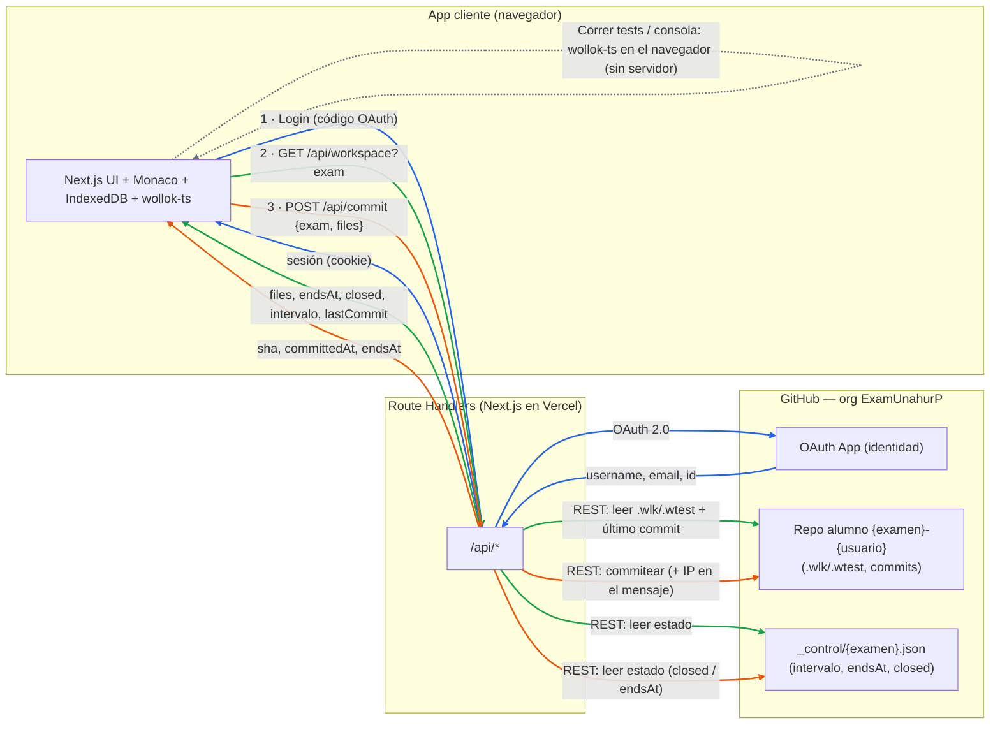
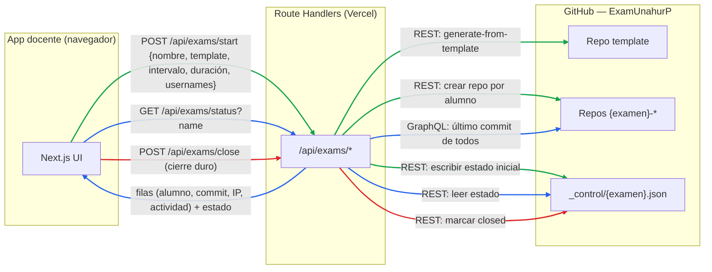
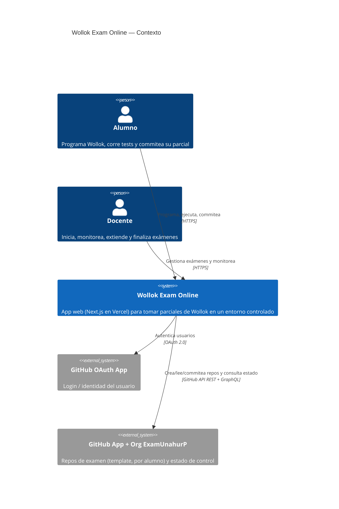
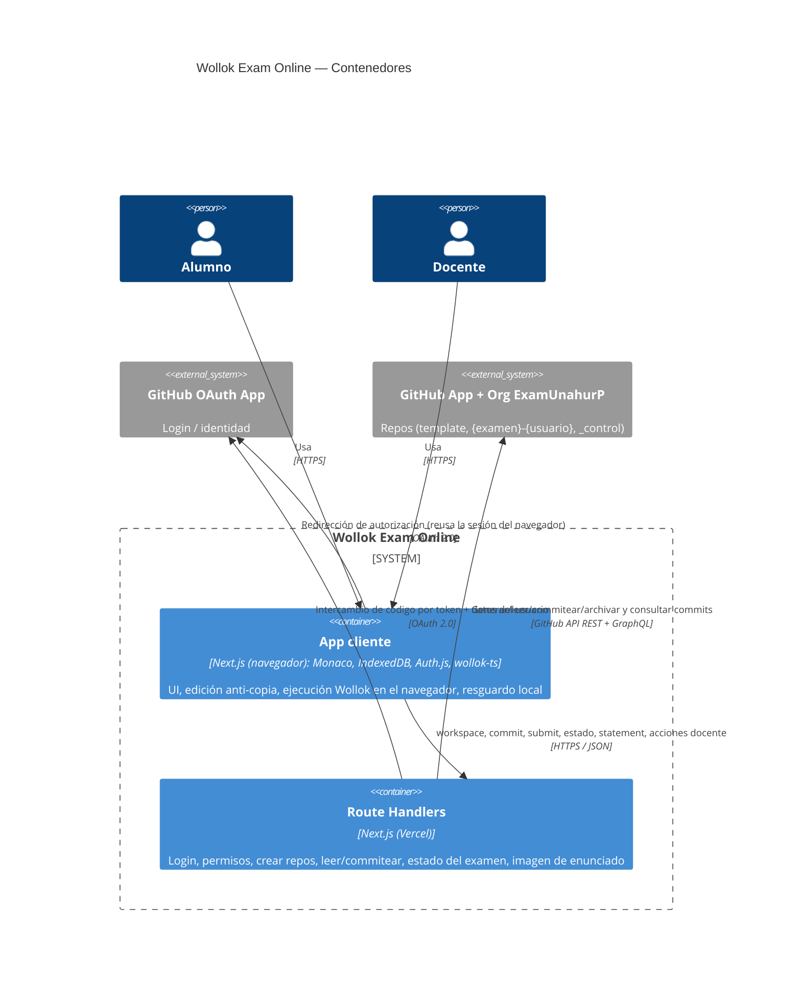

# Arquitectura — Wollok Exam Online

> **Nota sobre la ejecución de Wollok:** en esta implementación la compilación y
> ejecución de tests/consola corre **en el navegador con `wollok-ts`** (no hay una
> "Workspace API" server-side). Si en el futuro se mueve a un servidor, se agrega como
> contenedor y se actualizan los diagramas.

## Dueño de cada dato

| Dato | Dueño / fuente de verdad | Dónde vive |
|---|---|---|
| Identidad del usuario (username, email, id) | **GitHub OAuth App** | GitHub |
| Código del alumno (`.wlk`/`.wtest`) + **entrega oficial** | **Repo `{examen}-{usuario}`** | GitHub (org `ExamUnahurP`) |
| Estado del examen (intervalo, `endsAt`, `closed`) | **`_control/{examen}.json`** | GitHub (org `ExamUnahurP`) |
| Template del examen | **Repo template** | GitHub (org `ExamUnahurP`) |
| Copia local / recuperación | Navegador (IndexedDB) | Cliente — **no** es fuente de verdad |
| Ejecución de tests/consola | Navegador (`wollok-ts`) | Cliente — efímero, sin servidor |

---

## Flujo de datos (qué le pide el cliente y a quién)

Colores: 🔵 **Login** · 🟢 **Cargar examen** · 🟠 **Commit** · ⚪ **Ejecutar (sin servidor)**.



Notas:
- El **navegador nunca** habla directo con GitHub (salvo el redirect de login OAuth, que es
  inherente al login). Repos y estado siempre pasan por los Route Handlers (GitHub App).
- **Ejecutar tests/consola no genera ninguna llamada al servidor** (corre en el navegador).
- IndexedDB se usa en el cliente para resguardo/recuperación; no aparece como llamada externa.

---

## Endpoints (Route Handlers de Next.js)

Todos viven bajo `app/api/**`. El navegador **solo** habla con estos (nunca con GitHub directo).

| Endpoint | Método | Lo usa | Para qué | GitHub que toca |
|---|---|---|---|---|
| `/api/auth/[...nextauth]` | GET/POST | Alumno y docente | Login con GitHub (Auth.js) | OAuth App |
| `/api/workspace?exam=` | GET | Alumno | Cargar el examen (archivos + estado) | Repo del alumno + `_control` |
| `/api/commit` | POST | Alumno | Auto/Manual commit del trabajo | Repo del alumno (+ `_control`) |
| `/api/submit` | POST | Alumno | Entrega final | Repo del alumno (+ `_control`) |
| `/api/statement?exam=` | GET | Alumno | Imagen del enunciado | Repo del alumno |
| `/api/export-auth` | POST | Alumno (con código docente) | Validar código para exportar `.zip` | — (solo valida `EXPORT_CODE`) |
| `/api/exams/start` | POST | Docente | Iniciar examen: generar repos por alumno | Template → repos + `_control` |
| `/api/exams/status?name=` | GET | Docente | Dashboard (último commit + IP + actividad) | Repos `{examen}-*` (GraphQL) + `_control` |
| `/api/exams/close` | POST | Docente | Cierre duro (nadie commitea más) | `_control` |
| `/api/exams/extend` | POST | Docente | Sumar minutos a la hora de fin | `_control` |

> **Notas:**
> - **`/api/exams/state` NO existe.** En el modelo **sin polling**, el cliente recibe
>   `endsAt` al cargar (`/api/workspace`) y en cada respuesta de `/api/commit`. No se sondea.
> - **Hora de fin:** se fija al iniciar (`durationMinutes` → `endsAt` en `_control`, o sin
>   límite si es 0) y se ajusta con `/api/exams/extend`. El cierre manual inmediato es
>   `/api/exams/close`. (Reemplazó al viejo `/api/exams/countdown`, ya eliminado.)
> - **Config del examen:** vive solo en `_control/{examen}.json` (intervalo + `endsAt` +
>   `closed`). No se escribe nada dentro del repo del alumno.

## Flujo del docente



---

## C4 — Diagrama de Contexto



---

## C4 — Diagrama de Contenedores



### Responsabilidades

- **App cliente (navegador):** UI; editor Monaco con bloqueo de copiar/pegar; ejecución de
  tests y consola con `wollok-ts` (sin servidor); IndexedDB para recuperación local; inicio
  del login con Auth.js. **Nunca** accede a GitHub (repos) ni guarda la verdad.
- **Route Handlers (Next.js / Vercel):** único intermediario hacia afuera. Login, validación
  de permisos, crear repos desde template, leer/commitear archivos, capturar la IP en el
  commit, estado del examen (intervalo/endsAt/closed), servir la imagen del enunciado.
- **GitHub OAuth App:** identidad del usuario (login).
- **GitHub App + Org ExamUnahurP:** repos de examen (template + por alumno) y `_control`;
  fuente de verdad de la entrega y del estado.

### Restricciones

- El navegador nunca accede directo a GitHub (repos) — solo vía Route Handlers (la única
  excepción es el redirect de login OAuth).
- GitHub es la **fuente oficial de la entrega**; IndexedDB es solo recuperación local.
- El docente usa la **misma app** que el alumno (cambia el rol según `TEACHERS`).
```
